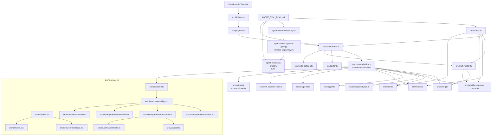

# Orca CLI System Architecture

## 2026-05-03 Architecture Delta - Markdown Artifact Write Integrity

This tranche fixes a tool-orchestration guard bug rather than the underlying file tools:

1. Artifact extraction:
   - `src/commands/local-file-intent.ts`
   - `selectAssistantContentForFile()` no longer returns the full assistant response.
   - It now extracts fenced Markdown/text blocks, explicit content markers, or the first Markdown artifact structure such as headings, frontmatter, lists, tables, or blockquotes.
2. False-save repair safety:
   - `buildPostModelSaveRepairPlan()` still repairs provider false-save claims, but only when a real artifact body is extractable.
   - Conversational save confirmations without artifact content return `null`, so Orca does not create a polluted `.md` file.
3. Prompt contract:
   - `src/system-prompt.ts`
   - The system prompt now tells providers that `write_file.content` must be the final requested file body only.
4. Regression coverage:
   - `tests/local-file-intent.test.ts`
   - `tests/chat-internals.test.ts`
   - `tests/e2e-workflow.test.ts`

## 2026-05-02 Architecture Delta - Tool-Call Continuity and Blackfin Mark

This tranche closes the remaining local-file/tool-call and startup-identity gaps exposed by the launcher screenshots:

1. Long-session provider prompt assembly:
   - `src/providers/openai-compat.ts`
   - `streamChat()` now builds messages through a single helper that always prepends the current system prompt before history and the new user message.
   - If history already contains the same leading system prompt, the helper skips the duplicate so long REPL sessions keep tool instructions without double-injecting them.
2. Local-file tool contract:
   - `src/system-prompt.ts`
   - The generated system prompt now explicitly requires local file creation/opening requests to use `write_file`, `read_file`, `file_info`, or `open_file` before reporting failure.
3. Local-file intent guard:
   - `src/commands/local-file-intent.ts`
   - `src/commands/chat-repl-turn.ts`
   - `src/commands/chat.ts`
   - Obvious REPL read/write/open requests are converted into local tool plans before the provider call.
   - If a provider response claims a file was saved but no `write_file` / `open_file` call happened, the proxy runtime writes the claimed file from the response transcript and records the repair in conversation history.
   - If a later prompt says the previously claimed file is missing and asks to open it, the REPL guard reconstructs the file from assistant history and calls `open_file`.
4. Large-scale tool-call matrix:
   - `agent-eval/manifests/test-matrix.json`
   - Adds a `tool-calls` layer spanning `tests/tools.test.ts`, `tests/tools-full.test.ts`, `tests/local-file-intent.test.ts`, `tests/chat-proxy-tool-call.test.ts`, `tests/mcp-client.test.ts`, `tests/chat-one-shot-mcp-cleanup.test.ts`, `tests/openai-compat-multimodal.test.ts`, and `tests/e2e-workflow.test.ts`.
   - `package.json` exposes the generated `npm run test:tool-calls` entrypoint.
5. Startup wordmark and clean Blackfin deck:
   - `src/ui/components/Banner.tsx`
   - The startup deck now uses a dominant `ORCA-AGENT` wordmark instead of the old compact `ORCA` mark.
   - The rejected independent Orca hero/icon art has been removed from the deck.
   - The deck mirrors Hermes' large-wordmark hierarchy and themed status panel while staying inside Orca's active Ink theme tokens.
6. Regression coverage:
   - `tests/local-file-intent.test.ts`
   - `tests/chat-internals.test.ts`
   - `tests/chat-repl-turn.test.ts`
   - `tests/openai-compat-multimodal.test.ts`
   - `tests/e2e-workflow.test.ts`
   - `tests/ink-ui.test.tsx`
   - `agent-eval/generated/test-matrix-entrypoints.md`

## 2026-05-02 Architecture Delta - Model Catalog SSoT

The model-catalog tranche tightens the boundary between model metadata, runtime budgeting, provider requests, and operator-facing output:

1. Canonical metadata:
   - `src/model-metadata.ts`
   - Owns context windows, max output defaults, pricing tiers, and capacity/pricing formatting helpers.
   - Provides conservative defaults for unknown runtime models without preserving old duplicate tables.
2. Provider-aware catalog:
   - `src/model-catalog.ts`
   - Re-exports metadata helpers and keeps the provider-aware `ModelChoice` construction, provider grouping, duplicate-model keys, and agentic caution rules.
3. Runtime budget:
   - `src/token-budget.ts`
   - Reads context windows and max output values from the canonical metadata helpers.
4. Provider request defaults:
   - `src/providers/openai-compat.ts`
   - Uses the same context window helper for context hard-stop thresholds and the same max-output helper for `max_tokens` / `max_completion_tokens`.
5. Operator output:
   - `src/output.ts`
   - Uses the canonical capacity formatter for startup provider info and the canonical pricing helper for usage/session cost estimates.
6. Regression coverage:
   - `tests/model-catalog.test.ts`
   - Verifies shared metadata behavior and scans runtime consumers for reintroduced metadata tables.

## 2026-05-02 Architecture Delta - Terminal Operability Hardening

The terminal-operability tranche tightens the boundary between UI rendering, project cwd resolution, built-in tools, and MCP routing:

1. Terminal rendering:
   - `src/ui/render.tsx`
   - Default Ink rendering now stays in the primary terminal buffer.
   - `AlternateScreen` is preserved behind explicit fullscreen/no-flicker flags (`ORCA_TUI=fullscreen`, `ORCA_NO_FLICKER=1`, `ORCA_ALT_SCREEN=1`, or `CLAUDE_CODE_NO_FLICKER=1`) for operators who need Claude-style repaint suppression.
   - Fullscreen/no-flicker mode enters the alternate buffer before Ink's first frame and wraps the app only for cleanup/SIGCONT recovery.
   - Fullscreen/no-flicker mode keeps only recent visible blocks in the render tree to lower repaint pressure during long conversations.
2. Mouse input:
   - `src/ui/components/App.tsx`
   - `useMouseWheel` is inactive by default so ordinary terminal selection remains copyable.
   - Mouse tracking can be restored with `ORCA_MOUSE=1`.
3. Workspace cwd resolution:
   - `src/commands/chat-support.ts`
   - `src/commands/chat.ts`
   - Explicit `--cwd`, `ORCA_CWD`, and `ORCA_PROJECT_DIR` are highest priority.
   - Ambient project directories win over remembered state.
   - Non-workspace launch directories fall back to `~/.orca/last-cwd` when available.
4. Launcher/root command surface:
   - `src/program.ts`
   - Root `orca --cwd <dir>` forwards into the delegated `orca chat` command.
5. MCP routing:
   - `src/mcp-client.ts`
   - `parseMcpToolName()` splits on the last `__`, allowing server names with underscores.
   - Codex TOML parsing accepts hyphenated server names.
6. Built-in local file opening:
   - `src/tools.ts`
   - `open_file` opens existing files with the OS default app.
   - The tool is included in `DANGEROUS_TOOLS` because it launches an external process.
7. Regression coverage:
   - `tests/ink-ui.test.tsx`
   - `tests/chat-support.test.ts`
   - `tests/program.test.ts`
   - `tests/mcp-client.test.ts`
   - `tests/tools.test.ts`
   - `tests/tools-full.test.ts`
   - `tests/hooks.test.ts`
   - `tests/e2e-workflow.test.ts`
   - `tests/adversarial.test.ts`

## 2026-05-02 Architecture Delta - Critique Quality Gate

The critique-gate tranche adds a bounded quality layer beside the existing workflow and multi-model layers:

1. Critique core:
   - `src/critique.ts`
   - Defines critique checkpoints, weighted risk scoring, complementary reviewer selection, changed-diff-line counting, prompt assembly, and structured result parsing.
   - Keeps the report-derived risk formula centralized for tests and future automatic checkpoint integration.
2. Workspace inspection adapter:
   - `src/critique-workspace.ts`
   - Reads current diff, changed files, optional plan/log/diff files, project rules, and risk flags.
   - Produces one reusable inspection object for standalone CLI dry-runs, live critique calls, and chat slash rendering.
3. Command surface:
   - `src/commands/critique.ts`
   - Adds `orca critique [goal...]` with checkpoint, plan, log, diff, risk, reviewer, provider, dry-run, and JSON flags.
   - Reads current `git diff` and changed files by default; `--diff-file` supports deterministic local tests and offline review packets.
4. Chat slash surface:
   - `src/commands/chat-slash-readonly.ts`
   - Adds `/critique` as a read-only local inspection inside `orca chat`.
   - Legacy output uses command messages; Ink output uses a `Critique Gate` detail panel.
5. Automatic chat hint:
   - `src/critique-auto.ts`
   - `src/commands/chat.ts`
   - `src/commands/chat-repl-turn.ts`
   - Keeps one suppression state per REPL session, inspects the dirty diff before provider send, and emits a local warning when the diff crosses the auto hint threshold.
   - One-shot `orca chat "prompt"` uses `emitOneShotAutoCritiqueNotice` before `executeOneShot`; streaming mode writes the hint to stderr, while JSON mode stays silent.
   - Uses `includePrompt: false` workspace inspection so automatic hints do not build reviewer prompts, call providers, or mutate the outgoing user prompt.
   - `orca chat --no-auto-critique` and `orca chat --auto-critique-threshold <score>` override the session behavior; env vars remain the lower-level default path.
6. Provider boundary:
   - Reuses `resolveConfig`, `findAggregator`, `resolveModelEndpoint`, and `chatOnce`.
   - Live critique routes through existing provider configuration; dry-run never requires a provider key.
7. Safety contract:
   - The prompt explicitly frames the reviewer as read-only.
   - The command and slash surface do not execute suggested fixes; the main agent must validate findings before editing.
   - Automatic chat hints are advisory only and can be disabled with `ORCA_AUTO_CRITIQUE=0`.
8. Hook trust stability:
   - `src/hooks.ts`
   - `HookManager.load()` re-checks `ORCA_TRUST_PROJECT_HOOKS` so project hook trust is evaluated at hook-loading time, not only singleton construction time.
9. Regression coverage:
   - `tests/critique.test.ts`
   - `tests/chat-repl-turn.test.ts`
   - `tests/chat-slash-readonly.test.ts`
   - `tests/v050-modules.test.ts`
   - `tests/program.test.ts`
   - `tests/command-contracts.test.ts`

## 2026-05-01 Architecture Delta - Pod Helm Footer UI/UX

The helm-footer tranche stays inside the existing Ink footer rendering boundary:

1. Footer rail identity:
   - `src/ui/components/Footer.tsx`
   - The footer now starts with `POD HELM`.
   - Identity, shortcut keys, and labels resolve through active theme semantic tokens.
2. Context-aware copy:
   - Generating state keeps `esc` and changes the label to `interrupt echo`.
   - Active input state keeps `enter`, `ctrl+j`, `/help`, and `shift+tab`, with pod-oriented labels such as `send brief` and `pod commands`.
   - Idle state keeps the core brief, command, and permission-mode hints.
3. Width-aware rendering:
   - The footer uses `cols` from `useTerminalSize()`.
   - Lower-priority active hints (`ctrl+z`, `ctrl+l`) render only on wider terminals.
   - Shortcut groups use non-shrinking boxes so `POD HELM` and core labels do not split into incoherent columns.
4. Data and behavior contract:
   - Shortcut handling remains in the existing input/runtime layers.
   - `permMode` and `permSource` data flow is unchanged.
   - The tranche only changes rendering copy, responsive inclusion, and tone token resolution.
5. Regression coverage:
   - `tests/ink-ui.test.tsx`
   - Tests assert `POD HELM`, `interrupt echo`, `send brief`, `pod commands`, permission-mode visibility, and idle/generating state behavior.

## 2026-05-01 Architecture Delta - Pod Council Runway UI/UX

The council-runway tranche stays inside the existing Ink multi-model progress rendering boundary:

1. Multi-model progress frame:
   - `src/ui/components/MultiModelProgress.tsx`
   - The header now starts with `POD COUNCIL` and preserves the `command` value.
   - Model count now renders as coordinated `voices`.
2. Model row states:
   - Completed rows now render `surfaced`.
   - Active rows now render `sonar` next to the existing spinner.
   - Model names and elapsed seconds remain visible.
3. Theme token resolution:
   - `src/ui/components/MultiModelProgress.tsx`
   - Header, active, completed, and model-name color roles now resolve through active theme semantic tokens.
   - Hard-coded `cyan` and `green` are no longer used in this component.
4. Data contract:
   - `src/ui/types.ts`
   - `ModelProgress` is unchanged; the tranche only changes rendering copy and tone token resolution.
5. Regression coverage:
   - `tests/ink-ui.test.tsx`
   - Tests assert `POD COUNCIL`, command name, voice count, model names, `surfaced`, `sonar`, and elapsed time.

## 2026-05-01 Architecture Delta - Pod Evidence Drawer UI/UX

The evidence-drawer tranche stays inside the existing Ink detail panel rendering boundary:

1. Detail panel frame:
   - `src/ui/components/DetailPanel.tsx`
   - The rendered title now starts with `EVIDENCE DRAWER` and preserves the source `info.title`.
   - The rendered subtitle now starts with `pod scan` and preserves the source `info.subtitle` when present.
2. Tone resolution:
   - `src/ui/components/DetailPanel.tsx`
   - `info`, `warn`, and `error` panel borders now resolve through active theme semantic tokens.
   - Hard-coded `cyan`, `yellow`, and `red` colors are no longer used in this component.
3. Data contract:
   - `src/ui/types.ts`
   - `DetailPanelInfo` is unchanged; the tranche only changes rendering copy and tone token resolution.
4. Regression coverage:
   - `tests/ink-ui.test.tsx`
   - Tests assert `EVIDENCE DRAWER`, original title, `pod scan`, original subtitle, and markdown body content.

## 2026-05-01 Architecture Delta - Pod Trust Gate UI/UX

The trust-gate tranche stays inside the existing Ink approval and diff rendering boundaries:

1. Permission prompt:
   - `src/ui/components/PermissionPrompt.tsx`
   - The prompt title now starts with `TRUST GATE` and keeps the tool name visible.
   - The preview is grouped under `SCAN`.
   - Choice descriptions now clarify once/session/project trust scope and deny posture without changing the decision payload shape.
   - Existing `y`, `n`, `1-4`, arrows, Enter, and Esc handling is unchanged.
2. Diff preview:
   - `src/ui/components/DiffPreview.tsx`
   - The preview header now starts with `ECHO DIFF`.
   - File path, add/remove counts, line numbers, truncation, and line-color semantics are preserved.
3. Regression coverage:
   - `tests/ink-ui.test.tsx`
   - Tests assert `TRUST GATE`, `SCAN`, trust-scope choice copy, keyboard footer hints, and `ECHO DIFF`.

## 2026-05-01 Architecture Delta - Pod Proof Wake UI/UX

The proof-wake tranche stays inside the existing post-turn summary rendering boundary:

1. Post-turn summary:
   - `src/ui/components/TurnSummary.tsx`
   - The compact summary now starts with `PROOF WAKE`.
   - Internal shorthand (`r`, `d`, `u`) is replaced with explicit `time`, `in`, `out`, `tools`, cost, and `tok/s` labels.
2. Data contract:
   - `src/ui/types.ts`
   - `TurnSummaryInfo` is unchanged; the tranche only changes rendering copy and hierarchy.
3. Regression coverage:
   - `tests/ink-ui.test.tsx`
   - Tests assert `PROOF WAKE`, elapsed time, input/output tokens, tool count, cost, and throughput.

## 2026-05-01 Architecture Delta - Pod Status Rail UI/UX

The status-rail tranche stays inside the existing Ink status rendering boundary:

1. Status identity:
   - `src/ui/components/StatusBar.tsx`
   - Line 1 keeps `ORCA POD`, model, context bar / percentage, and branch, and adds a compact `sonar` label for context load on ordinary-width terminals.
2. Signal stats:
   - `src/ui/components/StatusBar.tsx`
   - Line 2 now prefixes available metrics with `signal:` while preserving cost, token cadence, turns, session id, model policy, tool policy, output style, and sparkline output.
3. Trust state:
   - `src/ui/components/StatusBar.tsx`
   - Line 3 now prefixes permission posture with `trust:` and keeps permission source, behavior mode, effort, and shift-tab cycling guidance visible.
4. Regression coverage:
   - `tests/ink-ui.test.tsx`
   - Tests assert sonar context copy, signal rail copy, trust rail copy, and trust-cycle guidance while preserving existing field visibility.

## 2026-05-01 Architecture Delta - Pod Transcript Flow UI/UX

The transcript-flow tranche stays inside the existing Ink rendering boundary:

1. Transcript roles:
   - `src/ui/components/App.tsx`
   - User transcript blocks now label submitted prompts as `POD BRIEF`.
   - Assistant response blocks now label completed and streaming responses as `ORCA POD`; streaming state copy reads `echoing`.
2. Tool-call rails:
   - `src/ui/components/App.tsx`
   - `src/ui/components/ToolCallBlock.tsx`
   - Active and completed tool rails now include the `ECHO TOOL` label while preserving tool name, argument/path display, result state, duration, and error output.
3. Thinking state:
   - `src/ui/components/ThinkingSpinner.tsx`
   - The random status verb pool is now a compact Orca-oriented set for listening, echoing, routing, verifying, and surfacing evidence.
   - The rendered state begins with `POD` to keep generation feedback aligned with the transcript identity.
4. Regression coverage:
   - `tests/ink-ui.test.tsx`
   - Tests assert `POD BRIEF`, `ORCA POD`, `ECHO TOOL`, and `POD` thinking state while preserving markdown and tool visibility.

## 2026-05-01 Architecture Delta - Pod Command Surface UI/UX

The command-surface tranche stays inside the existing Ink UI component boundary:

1. Shared picker frame:
   - `src/ui/components/PickerFrame.tsx`
   - The frame now reads `useTheme()` directly and resolves border/title/subtitle/footer colors from semantic Orca tokens unless a caller overrides the border.
   - Picker titles receive a compact diamond signal prefix while preserving existing width and margin behavior.
2. Slash command discovery:
   - `src/ui/components/CommandPicker.tsx`
   - The panel title is now `POD COMMANDS`.
   - Filter feedback reads `echo filter: /<query>`.
   - No-match filters keep the picker visible with `no matching command`, and `Esc` still cancels even with zero results.
3. Option selection and input:
   - `src/ui/components/OptionPicker.tsx`
   - `src/ui/components/InputArea.tsx`
   - Option rows, descriptions, filter labels, and scroll affordances now use theme semantic tokens.
   - The input empty state now reads `Brief the pod... (/help for commands)` and multiline help reads `pod input`.
4. Regression coverage:
   - `tests/ink-ui.test.tsx`
   - Tests assert the pod command title, echo-filter copy, no-match state, and pod-brief placeholder.

## 2026-05-01 Architecture Delta - Mascot UI/UX

Superseded on 2026-05-02 for `Banner.tsx`: the independent mascot/icon block has been removed. The remaining architecture value from this tranche is the HomePanel pod-brief language.

The mascot tranche stays inside the existing Ink UI and test boundary:

1. Startup logo structure:
   - `src/ui/components/Banner.tsx`
   - `ORCA_WORDMARK_LINES` has been replaced by the current `ORCA-AGENT` display wordmark.
   - The former mascot/hero block is deleted; startup keeps the themed status rows only.
2. First-screen UX:
   - `src/ui/components/HomePanel.tsx`
   - The primary entry panel is now `POD BRIEF`, with copy that tells the operator to give Orca one outcome while the pod handles plan, tools, and evidence.
   - `POD SIGNAL`, `RECOVER`, and `GUARDRAILS` keep trust, state, recovery, and safety visible.
3. Regression coverage:
   - `tests/ink-ui.test.tsx`
   - Tests assert the clean Banner deck, `POD BRIEF`, and the friendly briefing copy.

## 2026-04-30 Architecture Delta - Visual System

The visual system tranche stays inside the existing Ink UI boundary:

1. Theme source of truth:
   - `src/ui/theme.tsx`
   - `orcaTheme()` defines the `Blackfin Signal` semantic palette.
   - `resolveInitialTheme()` now returns `orca` as the default dark theme while preserving light mode and alternate themes.
2. Startup identity:
   - `src/ui/components/Banner.tsx`
   - Static `ORCA-AGENT` block wordmark replaces the low-recognition swimming art and later compact `ORCA` lockup.
   - No separate mascot/icon renders; compact terminals keep state rows coherent.
3. Entry control deck:
   - `src/ui/components/HomePanel.tsx`
   - Empty state is organized as `POD BRIEF`, `POD SIGNAL`, `RECOVER`, and `GUARDRAILS`.
4. Identity selection and status:
   - `src/ui/components/ThemePicker.tsx`
   - `src/ui/components/StatusBar.tsx`
   - `Blackfin Signal` is listed first and the status line uses `ORCA POD` language.
5. Regression coverage:
   - `tests/ink-ui.test.tsx`
   - Verifies banner, HomePanel, ThemePicker, and theme behavior after the visual refresh.

## 2026-04-29 Architecture Delta - Trust and Queue

The SOTA swarm audit adds two immediate architectural constraints:

1. Hook loading is now split by trust boundary:
   - home/global hooks remain startup-safe
   - repo-local `.orca` / `.claude` hooks require explicit project trust
   - hook subprocess env is allowlisted instead of inheriting the full parent process
2. `TaskRun` is now visible and leaseable through a first-class CLI queue surface:
   - `orca queue`
   - `orca queue list --status <status> --work-session <id> --limit <n>`
   - `orca queue show <task-run-id>`
   - `orca queue follow <task-run-id>`
   - `orca queue takeover <task-run-id> --holder <name> --ttl <duration>`
   - `orca queue evidence <task-run-id>`
   - `orca queue resume <task-run-id> --holder <name>`
   - `orca queue schedule --holder <name>`
3. Slash-command discovery now has a shared metadata registry:
   - `src/slash-commands.ts`
   - REPL completion
   - Ink command picker
   - `/help` rendering
   - HomePanel command metadata prepared for the pending UI-baseline split
4. Release evidence now has a checked snapshot:
   - `doc/00_project/initiative_orca/verification_snapshot.json`
   - `tests/release-evidence.test.ts`
   - README release badge, package version, filesystem test-file count, and active PDCA evidence rows must stay aligned
5. CI gate integrity is now manifest-driven:
   - `.github/workflows/ci.yml`
   - `agent-eval/manifests/test-matrix.json`
   - `agent-eval/scripts/run-test-matrix.py`
   - `agent-eval/scripts/sync-test-matrix.py`
   - `agent-eval/generated/test-matrix-entrypoints.md`
   - CI runs matrix sync, static, security, performance, and fast agent-eval gates after the Node matrix
6. Ink transcript rendering is role-aware:
   - `ChatSessionEmitter.emitUserMessage()` exposes submitted prompt text to the UI event stream
   - `App.tsx` renders user turns as highlighted `You` blocks and assistant turns as structured `ORCA` panels
   - `MarkdownText.tsx` handles headings, bullets, inline emphasis, links, blockquotes, and highlighted code blocks without exposing raw markdown syntax as the primary structure
7. Review-before-apply approval history is part of the TaskRun contract:
   - `policy-executor` emits prompt, allowlist, policy, and hook decision events
   - `chat` appends those events to `TaskRun.approvals`
   - CLI `queue evidence` and Ink `/evidence` render the approval timeline before file evidence

Open architecture work:

- Keep `WorkSession` / `TaskRun` as the canonical execution contract across `chat`, `run`, mission, planner, and `serve /chat` surfaces.
- Keep scheduler / resume semantics honest: chat TaskRuns with saved-session metadata can print concrete `orca chat --continue` recovery commands; non-chat replay remains unsupported until replay-safe argv/prompt metadata is persisted.
- Keep `formatTaskRunEvidenceDrawerMarkdown` as the shared rendering contract for CLI `queue evidence` and Ink `/evidence` detail panels.
- Keep execution handlers separate until the unified execution contract is ready; the registry currently owns discovery metadata, not command behavior.
- Split the existing HomePanel UI baseline before wiring its command hints to the registry.
- Keep matrix layer definitions in the manifest; do not add package scripts or CI rows by hand without updating `sync-test-matrix.py` expectations.

<!-- AI-FLEET:PROJECT_DIR:START -->
- `PROJECT_DIR`: `/Users/mauricewen/Projects/orca-cli`
<!-- AI-FLEET:PROJECT_DIR:END -->

## Architecture Summary

Orca CLI is a TypeScript ESM CLI product composed of a terminal entry layer, command layer, runtime/config layer, provider bridge, and test/verification layer. It is a CLI runtime, so the primary surface is command invocation and streaming terminal output rather than browser routes.

Hook configuration now resolves from both project-local and operator-global Orca surfaces:
- project: `.orca/hooks.json`, `.orca.json`
- global: `~/.orca/hooks.json`
- compatibility imports: `.claude/hooks.json`, `.claude/settings.json`, `.codex/hooks.json`

MCP configuration now carries source provenance:
- startup-safe auto-connect: home/global-scoped MCP only
- project-scoped MCP: explicit opt-in through `/mcp connect` or equivalent operator action

## High-Level Diagram

## Layer Breakdown

| Layer | Files | Responsibility |
| --- | --- | --- |
| Entry | `src/bin/orca.ts` | Shell entry point and signal handling |
| Command assembly | `src/program.ts` | Registers commands and default prompt passthrough |
| Command modules | `src/commands/*.ts` | User-facing CLI flows (`chat`, `reflect`, `run`, `multi`, `bench`, `providers`, `stats`, `session`, `pr`, `serve`, `init`) |
| Runtime/config | `src/config.ts`, `src/context.ts`, `src/system-prompt.ts`, `src/token-budget.ts`, `src/model-catalog.ts`, `src/doctor.ts`, `src/commands/reflect-mode.ts`, `src/modes/registry.ts` | Resolve providers, model metadata, runtime diagnostics, context, prompts, runtime limits, and reflect/debugging behavior |
| Provider bridge | `src/providers/openai-compat.ts` | Provider-neutral transport and model interaction |
  Note: proxy path now supports multimodal one-shot prompt content (`text` + `image_url` parts) for local image attachments.
| Agent runtime | `src/tools.ts`, `src/background-jobs.ts`, `src/logger.ts`, `src/hooks.ts`, `src/mcp-client.ts`, `src/retry-intelligence.ts`, `src/auto-verify.ts` | Tool execution, detached job tracking, local runtime logging, hooks, provenance-aware MCP loading, retry behavior, verification helpers |
| Continuity objects | `src/work-session-store.ts` | File-backed `WorkSession` / `TaskRun` persistence for `run` default/goal-loop/mission/plan, `serve /chat`, queue inspection, takeover leases, lease-state classification, and resume/schedule plans |
| ink UI | `src/ui/` (18 files) | React terminal UI: App, ScrollBox, InputArea, StatusBar, Banner, Footer, ThinkingSpinner, ToolCallBlock, DiffPreview, MarkdownText, FileLink, PermissionPrompt, MultiModelProgress, CommandPicker, TurnSummary, AlternateScreen + hooks (useTerminalSize, useMouseWheel, usePasteHandler) + modules (cursor, theme, session, types, utils) |
| IDE integration | `integrations/vscode-orca/` | VS Code extension skeleton that launches `orca` terminal workflows and MCP server directly |
| Presentation (legacy) | `src/output.ts`, `src/markdown.ts`, `src/command-picker.ts` | Legacy terminal rendering (pre-ink fallback) |
| Persistence | `src/usage-db.ts` | Persistent usage/cost tracking |
| Verification | `tests/*.test.ts`, `AGENT_EVAL_PLAN.md`, `agent-eval/` | Deterministic regression coverage plus manifest-driven black-box gate execution for release-grade CLI evaluation |

## Command Surface Map

| Command | Source File | Purpose |
| --- | --- | --- |
| `orca` / `orca chat` | `src/commands/chat.ts` | Interactive REPL and one-shot prompting |
| `orca reflect` | `src/commands/chat.ts`, `src/commands/reflect-mode.ts` | Socratic debugging and root-cause investigation surface |
| `orca run` | `src/commands/run.ts` | Agent task execution with canonical WorkSession / TaskRun records for default, goal-loop, mission, and plan paths |
| `orca council` / `orca race` / `orca pipeline` | `src/commands/multi.ts` | Multi-model collaboration flows |
| `orca bench` | `src/commands/bench.ts` | Benchmark and self-evaluation |
| `orca doctor` | `src/commands/doctor.ts` | Local runtime/config diagnostics |
| `orca logs` | `src/commands/logs.ts` | Runtime log viewer |
| `orca providers` | `src/commands/providers.ts` | Provider introspection |
| `orca stats` | `src/commands/stats.ts` | Usage/cost reporting |
| `orca session` | `src/commands/session.ts` | Session lifecycle |
| `orca pr` | `src/commands/pr.ts` | Pull request review workflow |
| `orca serve` | `src/commands/serve.ts` | Headless HTTP + SSE runtime |
| `orca init` | `src/commands/init.ts` | Local configuration bootstrap |

## Route / Page Map

- Web routes: `N/A`
- Primary interaction surface: terminal commands and REPL slash-style workflows
- Reflect/debugging surface: `orca reflect`, `/reflect`, `/mode reflect`, plus conservative prompt-intent auto-triggering in standard chat
- Headless HTTP surface: `orca serve` (see `src/commands/serve.ts`)
- Detached job state: `~/.orca/background-jobs/` or `$ORCA_HOME/background-jobs/`
- Runtime logs: `~/.orca/logs/` or `$ORCA_HOME/logs/`
- Quality gate surfaces: `npm test`, `AGENT_EVAL_PLAN.md`, and future `agent-eval/{tasks,graders,runs}`
- Quality gate surfaces: `npm run eval:fast`, `npm run eval:nightly`, `npm run eval:release`, plus `agent-eval/{tasks,graders,manifests,runs}`
- Serve diagnostics: `/health`, `/providers`, `/doctor`
- Serve continuity discovery: `/sessions`, `/sessions/latest`, `/sessions/:id`, `/work-sessions`, `/work-sessions/latest`, `/work-sessions/:id`, `/work-sessions/:id/task-runs`, `/task-runs`, `/task-runs/:id`
- Serve canonical run entry: `POST /chat` returns `workSessionId` / `taskRunId` for non-streaming requests and emits the same ids in an SSE `metadata` event for streaming requests.
- Run canonical task entry: `orca run` writes `TaskRun` records for default, goal-loop, mission, and plan branches and stores usage plus mission-state evidence when available.
- Chat canonical task entry: interactive `orca chat` REPL turns write per-prompt `TaskRun` records under the active chat `WorkSession`, including status, usage, duration, and runtime observation ids.
- Queue recovery entry: `orca queue resume` and `orca queue schedule` reuse the same lease path, then render a resume plan. Chat saved sessions become `orca chat --cwd ... --continue <saved-session-id>` commands; running background jobs become `orca queue follow <task-run-id>` monitor commands.

## Legacy Documentation Cross-References

- `doc/THREE_TIER_ARCHITECTURE.md`: historical broader ecosystem architecture
- `doc/MULTI_MODEL_COLLABORATION.md`: early collaboration-mode design
- `doc/SOTA_TEST_PLAN.md`: historical hardening plan

## REPL Multimodal Prompt Assembly (2026-04-20)

- `src/commands/chat-input.ts`
  - now extracts embedded local image references from prompt text
  - keeps image-path detection separate from generic file expansion
- `src/commands/chat-repl-turn.ts`
  - assembles REPL turns into multimodal `PromptContent` before proxy dispatch
  - keeps auto-reflect intent bound to the original user text, not expanded file content
- `src/commands/chat.ts`
  - proxy history now stores the original multimodal user turn instead of flattening it immediately

Architectural invariant:

- image attachments are only promoted on the proxy-provider path; SDK/native path remains text-only

## History Scroll And Local File Enforcement (2026-05-03)

- `src/ui/components/App.tsx`
  - computes separate history-scroll activation for non-text keys and vim-style text shortcuts
  - keeps non-text history scroll active during prompt input
- `src/ui/components/ScrollBox.tsx`
  - accepts `keyboardActive` for non-text scroll controls
  - accepts `vimKeysActive` for `g/G` text shortcut navigation
- `src/commands/local-file-intent.ts`
  - keeps pre-model direct local-file plans for explicit content, existing-file open/read, and missing claimed-file repair
  - adds post-model generated-artifact write planning for explicit local save/create/generate prompts
  - adds enforcement notices for requested local file operations that lack matching tool evidence
- `src/commands/chat.ts`
  - executes post-model local file repair/generated-write plans before claim-evidence guarding
  - records enforcement notices into the assistant history so later turns do not treat incomplete local file operations as successful evidence
