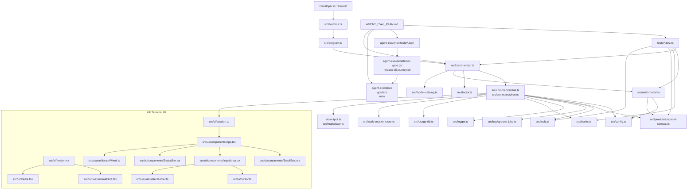

# Orca CLI System Architecture

## 2026-04-29 Architecture Delta - Trust and Queue

The SOTA swarm audit adds two immediate architectural constraints:

1. Hook loading is now split by trust boundary:
   - home/global hooks remain startup-safe
   - repo-local `.orca` / `.claude` hooks require explicit project trust
   - hook subprocess env is allowlisted instead of inheriting the full parent process
2. `TaskRun` is now visible and leaseable through a first-class CLI queue surface:
   - `orca queue`
   - `orca queue list --status <status> --work-session <id> --limit <n>`
   - `orca queue show <task-run-id>`
   - `orca queue follow <task-run-id>`
   - `orca queue takeover <task-run-id> --holder <name> --ttl <duration>`
   - `orca queue evidence <task-run-id>`
3. Slash-command discovery now has a shared metadata registry:
   - `src/slash-commands.ts`
   - REPL completion
   - Ink command picker
   - `/help` rendering
   - HomePanel command metadata prepared for the pending UI-baseline split
4. Release evidence now has a checked snapshot:
   - `doc/00_project/initiative_orca/verification_snapshot.json`
   - `tests/release-evidence.test.ts`
   - README release badge, package version, filesystem test-file count, and active PDCA evidence rows must stay aligned
5. CI gate integrity is now manifest-driven:
   - `.github/workflows/ci.yml`
   - `agent-eval/manifests/test-matrix.json`
   - `agent-eval/scripts/run-test-matrix.py`
   - `agent-eval/scripts/sync-test-matrix.py`
   - `agent-eval/generated/test-matrix-entrypoints.md`
   - CI runs matrix sync, static, security, performance, and fast agent-eval gates after the Node matrix
6. Ink transcript rendering is role-aware:
   - `ChatSessionEmitter.emitUserMessage()` exposes submitted prompt text to the UI event stream
   - `App.tsx` renders user turns as highlighted `You` blocks and assistant turns as structured `ORCA` panels
   - `MarkdownText.tsx` handles headings, bullets, inline emphasis, links, blockquotes, and highlighted code blocks without exposing raw markdown syntax as the primary structure
7. Review-before-apply approval history is part of the TaskRun contract:
   - `policy-executor` emits prompt, allowlist, policy, and hook decision events
   - `chat` appends those events to `TaskRun.approvals`
   - CLI `queue evidence` and Ink `/evidence` render the approval timeline before file evidence

Open architecture work:

- Keep `WorkSession` / `TaskRun` as the canonical execution contract across `chat`, `run`, mission, planner, and `serve /chat` surfaces.
- Promote queue lease semantics from CLI metadata into future scheduler / resume control after the execution contract is unified.
- Keep `formatTaskRunEvidenceDrawerMarkdown` as the shared rendering contract for CLI `queue evidence` and Ink `/evidence` detail panels.
- Keep execution handlers separate until the unified execution contract is ready; the registry currently owns discovery metadata, not command behavior.
- Split the existing HomePanel UI baseline before wiring its command hints to the registry.
- Keep matrix layer definitions in the manifest; do not add package scripts or CI rows by hand without updating `sync-test-matrix.py` expectations.

<!-- AI-FLEET:PROJECT_DIR:START -->
- `PROJECT_DIR`: `/Users/mauricewen/Projects/orca-cli`
<!-- AI-FLEET:PROJECT_DIR:END -->

## Architecture Summary

Orca CLI is a TypeScript ESM CLI product composed of a terminal entry layer, command layer, runtime/config layer, provider bridge, and test/verification layer. It is a CLI runtime, so the primary surface is command invocation and streaming terminal output rather than browser routes.

Hook configuration now resolves from both project-local and operator-global Orca surfaces:
- project: `.orca/hooks.json`, `.orca.json`
- global: `~/.orca/hooks.json`
- compatibility imports: `.claude/hooks.json`, `.claude/settings.json`, `.codex/hooks.json`

MCP configuration now carries source provenance:
- startup-safe auto-connect: home/global-scoped MCP only
- project-scoped MCP: explicit opt-in through `/mcp connect` or equivalent operator action

## High-Level Diagram

## Layer Breakdown

| Layer | Files | Responsibility |
| --- | --- | --- |
| Entry | `src/bin/orca.ts` | Shell entry point and signal handling |
| Command assembly | `src/program.ts` | Registers commands and default prompt passthrough |
| Command modules | `src/commands/*.ts` | User-facing CLI flows (`chat`, `reflect`, `run`, `multi`, `bench`, `providers`, `stats`, `session`, `pr`, `serve`, `init`) |
| Runtime/config | `src/config.ts`, `src/context.ts`, `src/system-prompt.ts`, `src/token-budget.ts`, `src/model-catalog.ts`, `src/doctor.ts`, `src/commands/reflect-mode.ts`, `src/modes/registry.ts` | Resolve providers, model metadata, runtime diagnostics, context, prompts, runtime limits, and reflect/debugging behavior |
| Provider bridge | `src/providers/openai-compat.ts` | Provider-neutral transport and model interaction |
  Note: proxy path now supports multimodal one-shot prompt content (`text` + `image_url` parts) for local image attachments.
| Agent runtime | `src/tools.ts`, `src/background-jobs.ts`, `src/logger.ts`, `src/hooks.ts`, `src/mcp-client.ts`, `src/retry-intelligence.ts`, `src/auto-verify.ts` | Tool execution, detached job tracking, local runtime logging, hooks, provenance-aware MCP loading, retry behavior, verification helpers |
| Continuity objects | `src/work-session-store.ts` | File-backed `WorkSession` / `TaskRun` persistence for `run` default/goal-loop/mission/plan, `serve /chat`, queue inspection, and takeover leases |
| ink UI | `src/ui/` (18 files) | React terminal UI: App, ScrollBox, InputArea, StatusBar, Banner, Footer, ThinkingSpinner, ToolCallBlock, DiffPreview, MarkdownText, FileLink, PermissionPrompt, MultiModelProgress, CommandPicker, TurnSummary, AlternateScreen + hooks (useTerminalSize, useMouseWheel, usePasteHandler) + modules (cursor, theme, session, types, utils) |
| IDE integration | `integrations/vscode-orca/` | VS Code extension skeleton that launches `orca` terminal workflows and MCP server directly |
| Presentation (legacy) | `src/output.ts`, `src/markdown.ts`, `src/command-picker.ts` | Legacy terminal rendering (pre-ink fallback) |
| Persistence | `src/usage-db.ts` | Persistent usage/cost tracking |
| Verification | `tests/*.test.ts`, `AGENT_EVAL_PLAN.md`, `agent-eval/` | Deterministic regression coverage plus manifest-driven black-box gate execution for release-grade CLI evaluation |

## Command Surface Map

| Command | Source File | Purpose |
| --- | --- | --- |
| `orca` / `orca chat` | `src/commands/chat.ts` | Interactive REPL and one-shot prompting |
| `orca reflect` | `src/commands/chat.ts`, `src/commands/reflect-mode.ts` | Socratic debugging and root-cause investigation surface |
| `orca run` | `src/commands/run.ts` | Agent task execution with canonical WorkSession / TaskRun records for default, goal-loop, mission, and plan paths |
| `orca council` / `orca race` / `orca pipeline` | `src/commands/multi.ts` | Multi-model collaboration flows |
| `orca bench` | `src/commands/bench.ts` | Benchmark and self-evaluation |
| `orca doctor` | `src/commands/doctor.ts` | Local runtime/config diagnostics |
| `orca logs` | `src/commands/logs.ts` | Runtime log viewer |
| `orca providers` | `src/commands/providers.ts` | Provider introspection |
| `orca stats` | `src/commands/stats.ts` | Usage/cost reporting |
| `orca session` | `src/commands/session.ts` | Session lifecycle |
| `orca pr` | `src/commands/pr.ts` | Pull request review workflow |
| `orca serve` | `src/commands/serve.ts` | Headless HTTP + SSE runtime |
| `orca init` | `src/commands/init.ts` | Local configuration bootstrap |

## Route / Page Map

- Web routes: `N/A`
- Primary interaction surface: terminal commands and REPL slash-style workflows
- Reflect/debugging surface: `orca reflect`, `/reflect`, `/mode reflect`, plus conservative prompt-intent auto-triggering in standard chat
- Headless HTTP surface: `orca serve` (see `src/commands/serve.ts`)
- Detached job state: `~/.orca/background-jobs/` or `$ORCA_HOME/background-jobs/`
- Runtime logs: `~/.orca/logs/` or `$ORCA_HOME/logs/`
- Quality gate surfaces: `npm test`, `AGENT_EVAL_PLAN.md`, and future `agent-eval/{tasks,graders,runs}`
- Quality gate surfaces: `npm run eval:fast`, `npm run eval:nightly`, `npm run eval:release`, plus `agent-eval/{tasks,graders,manifests,runs}`
- Serve diagnostics: `/health`, `/providers`, `/doctor`
- Serve continuity discovery: `/sessions`, `/sessions/latest`, `/sessions/:id`, `/work-sessions`, `/work-sessions/latest`, `/work-sessions/:id`, `/work-sessions/:id/task-runs`, `/task-runs`, `/task-runs/:id`
- Serve canonical run entry: `POST /chat` returns `workSessionId` / `taskRunId` for non-streaming requests and emits the same ids in an SSE `metadata` event for streaming requests.
- Run canonical task entry: `orca run` writes `TaskRun` records for default, goal-loop, mission, and plan branches and stores usage plus mission-state evidence when available.
- Chat canonical task entry: interactive `orca chat` REPL turns write per-prompt `TaskRun` records under the active chat `WorkSession`, including status, usage, duration, and runtime observation ids.

## Legacy Documentation Cross-References

- `doc/THREE_TIER_ARCHITECTURE.md`: historical broader ecosystem architecture
- `doc/MULTI_MODEL_COLLABORATION.md`: early collaboration-mode design
- `doc/SOTA_TEST_PLAN.md`: historical hardening plan

## REPL Multimodal Prompt Assembly (2026-04-20)

- `src/commands/chat-input.ts`
  - now extracts embedded local image references from prompt text
  - keeps image-path detection separate from generic file expansion
- `src/commands/chat-repl-turn.ts`
  - assembles REPL turns into multimodal `PromptContent` before proxy dispatch
  - keeps auto-reflect intent bound to the original user text, not expanded file content
- `src/commands/chat.ts`
  - proxy history now stores the original multimodal user turn instead of flattening it immediately

Architectural invariant:

- image attachments are only promoted on the proxy-provider path; SDK/native path remains text-only
